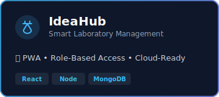
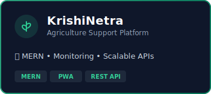

  

  

  
  

 

## 🚀 About Me
- 🔭 Building and shipping **scalable MERN & PWA products**
- ⚙️ **MVP-first**, execution-driven developer (real users > demos)
- 👯 Open to **startups, hackathons & fast-moving teams**
- 🧠 Focused on **performance, scalability & production readiness**
- 🌱 Learning **backend architecture, cloud & DevOps**
- ⚡ **SIH 2025 Finalist** — thrive under pressure

## 🛠️ Tech Stack

  

 

## 📊 GitHub Stats

  
  &nbsp;&nbsp;&nbsp;&nbsp;
  

  

## 🐍 Contribution Snake

<picture>
  <source media="(prefers-color-scheme: dark)" srcset="https://raw.githubusercontent.com/KalpeshBire/KalpeshBire/output/github-snake-dark.svg" />
  <source media="(prefers-color-scheme: light)" srcset="https://raw.githubusercontent.com/KalpeshBire/KalpeshBire/output/github-snake.svg" />
  
</picture>

  

  

 ## 🚀 Current Projects

  
  &nbsp;&nbsp;
  

 

  

